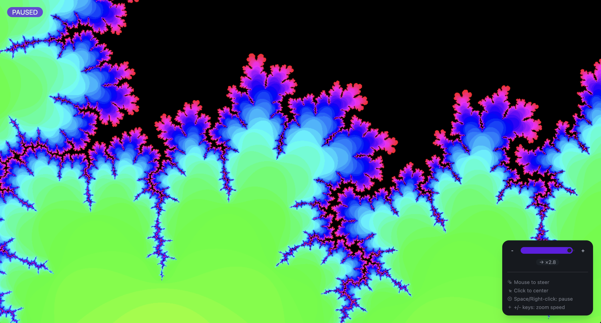

# Mandelbrot Explorer

An interactive Mandelbrot set explorer with infinite zoom capabilities, built on top of the [High-Performance Particle System](https://github.com/iteacher/particle-system) framework.



## Features

- Infinite zoom with smooth animation
- Click to center on any point
- Mouse movement to steer through the fractal
- Adjustable zoom speed with slider or +/- keys
- Pause/resume with spacebar or right-click
- Real-time rendering with double buffering
- Elegant UI with DaisyUI components

## Project Structure

```
mandelbrot/
├── public/
│   ├── assets/
│   │   ├── images/
│   │   │   └── mandelbrot.png
│   │   └── textures/
│   │       ├── orb.png
│   │       └── particle.png
│   ├── styles/
│   │   └── styles.css
│   └── index.html
├── src/
│   ├── js/
│   │   └── main.ts
│   └── types.d.ts
├── package.json
├── tsconfig.json
├── webpack.config.js
├── postcss.config.js
└── tailwind.config.js
```

## Requirements

### Development Dependencies
```json
{
  "autoprefixer": "^10.4.16",
  "css-loader": "^6.8.1",
  "daisyui": "^3.9.4",
  "postcss": "^8.4.31",
  "postcss-loader": "^7.3.3",
  "style-loader": "^3.3.3",
  "tailwindcss": "^3.3.5",
  "ts-loader": "^9.5.0",
  "typescript": "^5.2.2",
  "webpack": "^5.89.0",
  "webpack-cli": "^5.1.4",
  "webpack-dev-server": "^4.15.1"
}
```

## Controls

- Mouse movement: Steer through the fractal
- Left click: Center on clicked point
- Right click/Space: Pause/resume animation
- +/- keys: Adjust zoom speed
- Slider: Fine-tune zoom speed and direction

## Development

```bash
# Install dependencies
npm install

# Start development server
npm start

# Build for production
npm run build
```

## Scripts

- `npm run build`: Build the project using webpack
- `npm start`: Start the development server with hot reloading
- `npm run watch`: Watch for changes and rebuild automatically

## Attribution

This project is built on top of the [High-Performance Particle System](https://github.com/iteacher/particle-system) framework, which provides the foundational WebGL rendering pipeline and optimization techniques. The original particle system framework has been adapted and extended to create this interactive Mandelbrot set explorer.

## License

MIT - Copyright (c) 2023 Julian Manders-Jones
